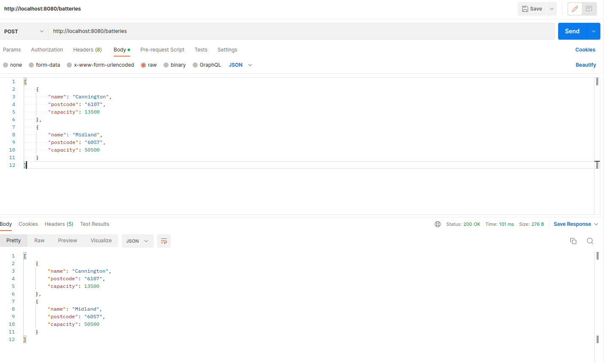
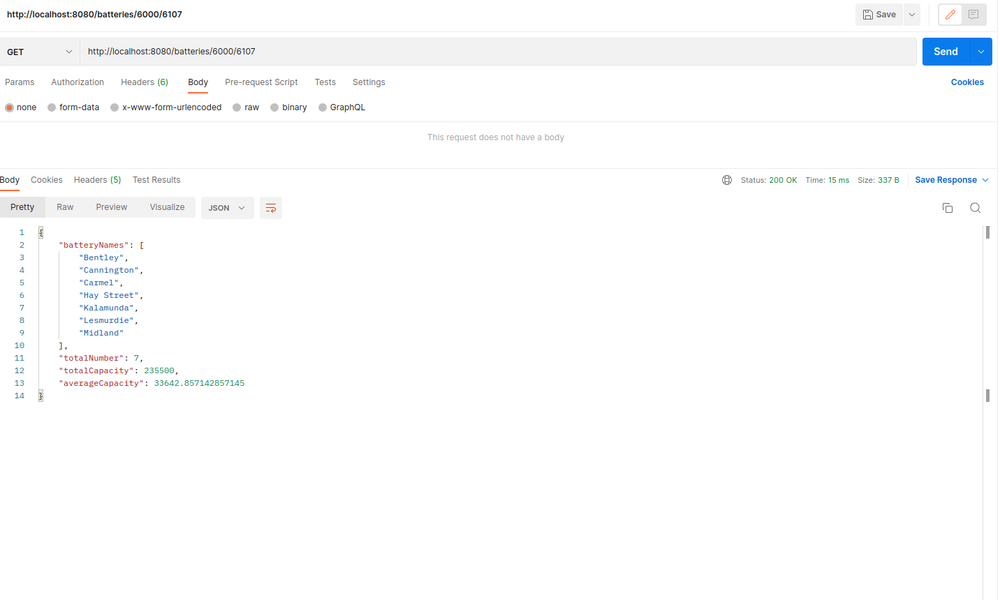

# Documentation of Project Powerplant, A coding test provided by Proshore: Solved By Sabin Gautam (savingautam5@gmail.com)

# Proshore-Powerplant

## Running the Project

In this project, `MongoDB` is the database used and can be run by `Docker` using `docker-compose.yml` file.
So first run the command: 
```bash
docker-compose up
```

Note: Docker and Docker Compose must be installed in your machine before running the command.

After the DataBase is running, we can run our spring application using the command below:
```bash
./gradlew bootRun
```
or you can locate 
`src/main/java/com/proshore/powerplant/PowerPlantSystemApplication.java` 
and run manually.

This application exposed tow api

* Post request "/batteries"
* Get Request "/batteries/{postcodeFrom}/{postcodeTo}"

The first request is used to save the batteries list and returns the same saved list and the second is used to get the information of batteries within the range postcodeFrom to postcodeTo
for example: "/batteries/8000/10000"

The Request and response of the Post API is shown in the Image below:



The Request and Response of the Get API is shown in the Image below: 



In the Get API, we obtain the list of Batteries in Ascending Order of their names and some statistics as 
 - totalNumber
 - totalCapacity
 - averageCapacity

`totalNumber` is the total number of batteries that falls between the range.
`totalCapacity` is the total sum of capacity of batteries that falls between the range.
`averageCapacity` is the averageCapacity of batteries that falls between the range.

# Details of Each Class

## Class: BatteryController, Package: com.proshore.powerplant.controller;

There is two function in this class.
### `public List<BatteryDto> saveBattery(@RequestBody List<BatteryDao> batteries)`
 - This is the function in our controller class annotated with `@PostMapping`, which is responsible for getting the Request Body from HttpRequest and Seralize it to POJO class `BatteryDao

### `public RangeDto getRangeInfo(@PathVariable String postcodeFrom, @PathVariable String postcodeTo)`
 - This is the function in our controller class annotated with `@GetMapping`, which is responsible for getting the details of Batteries, and statistics on the given range of postcodeFrom and postcodeTo.
 - Here I have converted the postcodeFrom and postcodeTo from String to long and maintained the order before passing it to Battery Service.

## Class: BatteryServiceImpl, Package:com.proshore.powerplant.service;

This is the Implementation Detail of class BatteryService, where the values are passed from BatteryController class.
This Class holds the main business logic.

There is two function in this class.

### `public List<BatteryDto> saveBatteries(List<BatteryDao> batteryDaos)`
In this function we give instruction to our repository, to save our battery. To understand the working of this function, we need to know about the models: BatteryDao, Battery, and BatteryDto. 
BatteryDao is data access object, i.e, that is used to serialize and deserialize the Json value to Java POJO Object directly from the REST API. That POJO class is BatteryDao. Battery is Entity POJO, which is created to save it to the database.
The Battery Class is annotated with `@Document("<collection_name>")` which specifies the instance of this POJO class as Document and will be saved with specified `collection_name`. 
In Battery, I have added field `private String id` annotated with `@Id`. This is the database primary key. The key is created manually as a concatenated string of all three attributes name, postcode and capacity. Here we see it as: 
```
batteryDaos.forEach(batteryDao -> {
            Battery batteryEntity = ToDto.toBatteryEntityFromDao(batteryDao);
            batteryEntities.add(batteryEntity);
        });
```

The concatenation is done during conversion of BatteryDao to Battery by the static function at ToDto Class. i.e, `Battery batteryEntity = ToDto.toBatteryEntityFromDao(batteryDao);`.

Now, we save the instance of Battery Object containing `@Id` via BatteryRepository. The returned value is also an instance of Battery form repository class. Now again we convert that returned Battery instance to BatteryDto instance, and returned as a Function DataType, that is used by Controller.

### `public RangeDto getRangeInfo(long postcodeFrom, long postcodeTo)`
- In this function, at first I have fetched all the saved list of battery from the database, which is a list of Battery Class. As, the main purpose of this service function is to filter out the list according to the field `postcode` from `postCodeFrom` to `postCodeTo`, we need to compare and filter out from the list.
For that purpose, I have converted each postcode of fetched entity to Long from String. Comparing in Long for numbered attributes gives accurate result, while comparing in String may not be fruitful in some cases. 
- Now, we have filtered entities, from which we extract the name of batteries and save in the List of String, and Sort it using `Collection.sort(list)`. Also, an average and total is calculated from the filtered list. 
- Now, in order to pass those values in a response of same API, I have created a POJO class named RangeDto, and build the instance of it passing the calculated values. Now, this instance is returned to controller in order to return the desired output via REST API.

## Interface: public interface BatteryRepository extends MongoRepository<Battery, String>, package: com.proshore.powerplant.service

This is a Repository Interface that is annotated with `@EnableMongoRepositories` or `@Repository` in general, Which extends to `MongoRepository<Battery, String>`. Here, Battery is the Entity Class, the respective instance is to be saved in DataBase. And String is the DataType of and primary Key that is to be saved.
It should be the same DataType annotated with `@Id` in Entity Class, i.e, Battery. Here, we connect our application to database using respective database Repository using its driver.
It contains two functions that are Connected to Service Class.
### `saveAll()` 
- Responsible for Saving the entities.
### `findAll()`
- Responsible to get all the DataBase entries of that Collection.

## Class: ToDto, package: com.proshore.powerplant.model.mapper
In this class, I have made some static function to convert the different models, i.e, Conversion between Battery, BatteryDao, and BatteryDto. It's easy and understandable.


# Note:
- All the Unit test are performed and all are passed.
- Database name of entries for Test and Real Application are different, which is defined in respective `application.properties` file.
- `docker-compose.yml` should be running for both test and application as most of the tests are Integration Test, which uses `Test Containers` for database. 
- While Saving batteries, the duplicate entries are not saved as the key of duplicate entry will be same. This is the main reason for creating key combining all attributes,
 otherwise, if we make postcode as primary, then there may be two or more entries of same postcode, which will discard the second battery from saving. Same issue will occur with the name and capacity too.
- I could have use UUID or MongoDb self created ObjectId as primary key, but this will enable multiple entries of same battery to be saved in database. 
Also, there is no chance or few chance of having two batteries with all fields exactly the same, name, postcode and capacity. Hence, the primary-key I have created works like the composite key combining all the fields of the Battery Entity.

- In this case, BatteryDao and BatteryDto are identical, and it would be okay of I have used only one. But in some cases we don't want to return every info as defined by Dao.
in that case Dto can be different. 

## words: 
- Dto -> referenced as `DTO, Data Transfer Object`, used to define output data from the application.
- Dao -> referenced as `DAO, Data Access Object`, used to access the data from outside, i.e, from `@RequestBody` parameter.
- Entity -> an Entity to insert the data into database.